# Flutter Wallet

[简体中文](./README.md) | English

Flutter Wallet is a Flutter + GetX multi-chain local hot wallet. It is currently intended for testing and learning, covering wallet creation/import, multi-chain assets, transfers, receiving, transaction history, network management, asset visibility, themes, and language switching.

## Recent Updates

- The home page now groups balances by token instead of network. A trusted token is aggregated across all supported chains, with a chain-level breakdown available on tap.
- Token grouping is data-driven through `canonicalTokenId`, so newly configured networks and assets are no longer tied to a fixed chain count or hard-coded home list.
- Added Bitcoin, Sui, Aptos, Base, Polygon, and Avalanche C-Chain mainnet support, including address derivation, balances, transfers, history, and block explorers.
- Home loading is cache-first and progressively refreshed per chain. EVM balances use JSON-RPC batching when possible, and a Shimmer skeleton is shown when no cache exists.
- Refined the home asset hero, wallet switcher, receive/transfer actions, and removed unused code and dependencies.

## Feature List

### Wallet And Security

- Create wallets with a 12-word mnemonic.
- Import wallets by mnemonic or private key.
- Manage multiple wallets: add, switch, rename, and remove.
- Derive EVM, TRON, Solana, Bitcoin, Sui, and Aptos addresses from the same wallet.
- Store mnemonics and private keys locally after password-based encryption.
- Require password verification for sensitive operations such as viewing private keys, viewing mnemonics, and signing transfers.
- Password cache settings.
- Mnemonic backup status tracking.

### Supported Chains

The app currently includes 12 mainnets:

| Network | Type | Native asset | Main asset support |
|---------|------|--------------|--------------------|
| Ethereum | EVM | ETH | Native coin and ERC20 |
| BNB Smart Chain | EVM | BNB | Native coin and BEP20/ERC20 |
| Arbitrum | EVM | ETH | Native coin and ERC20 |
| X Layer | EVM | OKB | Native coin and ERC20 |
| Base | EVM | ETH | Native coin and ERC20 |
| Polygon PoS | EVM | POL | Native coin and ERC20 |
| Avalanche C-Chain | EVM | AVAX | Native coin and ERC20 |
| Bitcoin | UTXO | BTC | Native SegWit P2WPKH |
| Solana | Solana | SOL | SOL and SPL tokens |
| Sui | Move | SUI | SUI and Sui Coin/USDC |
| Aptos | Move | APT | APT and Fungible Asset/USDC |
| TRON | TRON | TRX | TRX and TRC20 |

Network management:

- Edit names, symbols, and RPC lists for built-in chains.
- Add custom EVM networks.
- Check RPC latency and availability.
- Enable, disable, edit, and delete custom networks.
- Balance, asset visibility, receive, transfer, and history flows all consume the same persisted chain configuration.

### Assets And Balances

- Group home assets by trusted token identity instead of by chain.
- Show each token's cross-chain amount, total USD value, and network count; tap a token to inspect each chain and continue to single-chain history.
- Resolve built-in assets through trusted chain/contract mappings and `canonicalTokenId`. Unconfirmed custom tokens with the same symbol remain isolated to prevent unsafe merging and valuation.
- Query native coin and default token balances.
- Add custom tokens.
- Auto-read EVM token metadata: symbol, name, and decimals.
- Support token logos and quick-add popular token lists.
- Control asset visibility from Asset Settings; the home page no longer has a temporary “hide zero balance” switch.
- Load the latest local snapshot first, refresh in the background, and keep the last successful value when a provider fails.
- Query chains concurrently and update the home page as each chain completes. Multiple EVM assets on one chain use JSON-RPC batching when available.
- Show a token-list Shimmer skeleton only when the first load has no cache; the wallet hero and safety notices remain immediately visible.
- Display USD valuation with multiple price sources, including Binance, OKX, CoinGecko, DeFiLlama, CoinPaprika, and CryptoCompare.

### Transfers And Receiving

- EVM native coin and ERC20 transfers.
- TRON TRX and TRC20 transfers.
- Solana SOL and SPL token transfers.
- Bitcoin Native SegWit P2WPKH transfers with UTXO selection, dynamic fees, change, signing, and Esplora broadcast.
- Sui SUI/Coin transfers with simulation, gas estimation, Ed25519 signing, and submission.
- Aptos APT/Fungible Asset transfers with simulation, gas estimation, Ed25519 signing, and submission.
- Receive address QR code and one-tap copy.
- QR scanning for recipient address input.
- Transfer safety checks: address format, amount, balance, fee, large transfer, and new recipient warning.
- Save local pending records after submission and refresh transaction status.
- Transaction detail page with block explorer entry.

### Transaction History

- Default page size is 10 records, with load-more support.
- Cache-first loading.
- Merge local pending records with remote on-chain records.
- EVM data sources:
  - BSC, Arbitrum, Base, Polygon, and Avalanche prefer Moralis when a key is configured.
  - Ethereum supports Etherscan V2 and Blockscout fallback.
  - X Layer token history uses paged RPC logs as fallback; native OKB history needs an indexer because normal RPC cannot query complete address history.
- Solana data sources:
  - Helius Enhanced Transactions are preferred when `HELIUS_API_KEY` is configured.
  - Supports SOL and SPL tokens.
  - Parses `nativeTransfers`, `tokenTransfers`, and `accountData` balance changes.
  - Falls back to Solana RPC when Helius is unavailable.
- TRON data sources:
  - Requests include `TRON-PRO-API-KEY` when `TRONGRID_API_KEY` is configured.
  - Supports TRX and TRC20 history.
- Bitcoin data sources:
  - Uses mempool.space and Blockstream Esplora for BTC history, pagination, and transaction lookup.
- Sui data sources:
  - Uses Sui GraphQL for address-based pagination and parses coin balance changes and gas.
- Aptos data sources:
  - Uses Aptos Indexer GraphQL for APT/Fungible Asset activity and Fullnode data for transaction details and status.
- Base, Polygon, and Avalanche:
  - Support Etherscan V2, configured explorers, Blockscout where available, and RPC-log fallback paths.

### User Experience

- Chinese and English localization.
- Light and dark themes.
- Address book.
- Embedded block explorer WebView with back, forward, refresh, copy link, and external browser opening.
- Asset visibility management.
- Network management page.
- Token-first home portfolio with a first-load skeleton, cache-first rendering, and progressive per-chain refresh.
- Consistent lightweight wallet switch, receive, and transfer interactions with press feedback and accessibility semantics.

## API Keys And Environment Variables

Transaction history can fall back to public RPC or public explorers without API keys, but stability and completeness will be lower. For development and testing, configure `.env.local`.

### Create Local Config

```bash
cp .env.example .env.local
```

Supported variables:

```bash
ETHERSCAN_API_KEY=your_etherscan_v2_key
TRONGRID_API_KEY=your_trongrid_key
HELIUS_API_KEY=your_helius_key
MORALIS_API_KEY=your_moralis_key
```

### Where To Get Keys

| Variable | Usage | Where to apply |
|----------|-------|----------------|
| `ETHERSCAN_API_KEY` | Ethereum and other EVM explorer APIs. Etherscan V2 uses one key and the `chainid` parameter for multiple chains. | Create an Etherscan account and generate a key in the API Dashboard: https://etherscan.io/myapikey |
| `TRONGRID_API_KEY` | Stable access for TRON/TRC20 history and TRON APIs. | TronGrid Dashboard: https://www.trongrid.io |
| `HELIUS_API_KEY` | Solana/SPL transaction history through Helius Enhanced Transactions. | Helius Dashboard: https://dashboard.helius.dev |
| `MORALIS_API_KEY` | Native and ERC20/BEP20 history for BSC, Arbitrum, Base, Polygon, and Avalanche. | Moralis Dashboard: https://admin.moralis.com |

### Runtime Injection

Recommended local run:

```bash
scripts/flutter_run_with_env.sh
```

Android build scripts also read `.env.local`:

```bash
scripts/build_android.sh
scripts/build_android_bundle.sh
```

If you run directly from Android Studio, `.env.local` is not loaded automatically. Add these to Run Configuration -> Additional run args:

```bash
--dart-define=ETHERSCAN_API_KEY=...
--dart-define=TRONGRID_API_KEY=...
--dart-define=HELIUS_API_KEY=...
--dart-define=MORALIS_API_KEY=...
```

Notes:

- `.env.local` is ignored by Git. Do not commit real keys.
- Do not write real API keys in Dart source code, README files, or tests.
- `String.fromEnvironment` is read at launch/build time. After changing `.env.local`, fully restart the app or rebuild it; Hot Reload will not update keys.

## Quick Start

### Requirements

- A Flutter SDK that provides Dart 3.10.7 or later, as required by `pubspec.yaml`
- Android Studio or Xcode

### Install Dependencies

```bash
flutter pub get
```

### Generate Code

```bash
flutter pub run build_runner build
flutter pub run intl_utils:generate
```

### Run

```bash
flutter run

# Recommended: inject API keys from .env.local
scripts/flutter_run_with_env.sh
```

### Build

```bash
# Android APK
scripts/build_android.sh

# Android App Bundle
scripts/build_android_bundle.sh

# iOS
flutter build ipa --release
```

## Project Structure

```text
lib/
├── base/                         # BaseController / BasePage
├── common/                       # Shared theme
├── generated/                    # Generated routes and i18n code
├── l10n/                         # ARB localization source files
├── page/                         # Pages, controllers, widgets
├── utils/                        # Shared utilities
├── widget/                       # Shared widgets
└── wallet/
    ├── constants/                # Wallet constants
    ├── models/                   # Wallet and chain models
    ├── utils/                    # Wallet utilities
    └── services/
        ├── balance/              # Balance query part implementations
        ├── asset_valuation/      # Multi-provider price loading
        ├── config/               # Chain config, address book, custom assets, visibility
        ├── crypto/               # Key derivation and secure storage
        ├── transaction/          # Transaction cache, block explorer, transaction status
        ├── transaction_history/  # Transaction history providers
        ├── transfer/             # Transfer part implementations
        ├── chain_balance_service.dart
        ├── wallet_repository.dart
        ├── wallet_transfer_service.dart
        └── wallet_transaction_history_service.dart
```

## Common Commands

```bash
flutter pub get
dart format lib test
flutter analyze
flutter test
flutter test test/wallet_crypto_service_test.dart
flutter pub run build_runner build
flutter pub run intl_utils:generate
```

## Tests

Current tests mainly cover:

- Wallet key derivation and address generation
- EVM, Bitcoin, Solana, Sui, Aptos, and TRON chain/address rules
- Address book
- Mnemonic backup status
- Block explorer links
- Balance and custom asset logic
- Transfer encoding and submission logic
- EVM / Bitcoin / TRON / Solana / Sui / Aptos transaction history providers
- Cross-chain token grouping, trusted-asset isolation, valuation, and sorting
- Cache migration, progressive chain loading, and custom network/asset binding

## Security Notes

This is a local hot wallet project. It is not equivalent to a hardware wallet or a multi-signature wallet.

- Do not commit real private keys, mnemonics, API keys, or production wallet data.
- Do not print private keys, mnemonics, or signing material in logs.
- Transfer code is high-risk. Carefully verify address, amount, chain selection, fees, and error handling after changes.
- Use test wallets and small amounts for verification.

## Current Limitations

- Dynamically added networks currently support EVM-compatible chains only.
- Bitcoin, Solana, Sui, Aptos, and TRON are built-in chains and cannot currently be added as custom network types.
- Bitcoin currently supports Mainnet Native SegWit P2WPKH (`bc1q...`) addresses and transfers only.
- X Layer native OKB transaction history lacks a stable indexer; normal RPC cannot query complete address history.
- Asset valuation and transaction history depend on third-party APIs and can be affected by rate limits, plan restrictions, or provider incidents.
- This remains a learning/test hot wallet. Validate new chains and transfer paths on a test wallet with small amounts before practical use.

## Related Design Documents

- [Token-first home portfolio](docs/HOME_TOKEN_PORTFOLIO_REFACTOR.md)
- [Home balance loading optimization](docs/BALANCE_LOADING_OPTIMIZATION.md)
- [Bitcoin Mainnet implementation tasks](docs/BITCOIN_MAINNET_IMPLEMENTATION_TASKS.md)
- [Sui Mainnet implementation tasks](docs/SUI_MAINNET_IMPLEMENTATION_TASKS.md)
- [Aptos Mainnet implementation tasks](docs/APTOS_MAINNET_IMPLEMENTATION_TASKS.md)

## Screenshots

The latest project screens below are referenced directly from `assets/img/` and render inline on GitHub and other HTML-capable Markdown viewers:

| Home Portfolio | Wallet Switch | Add Wallet | Create Wallet |
|----------------|---------------|------------|---------------|
| 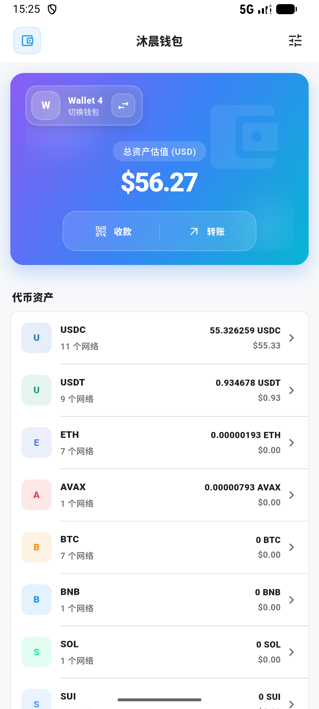 | 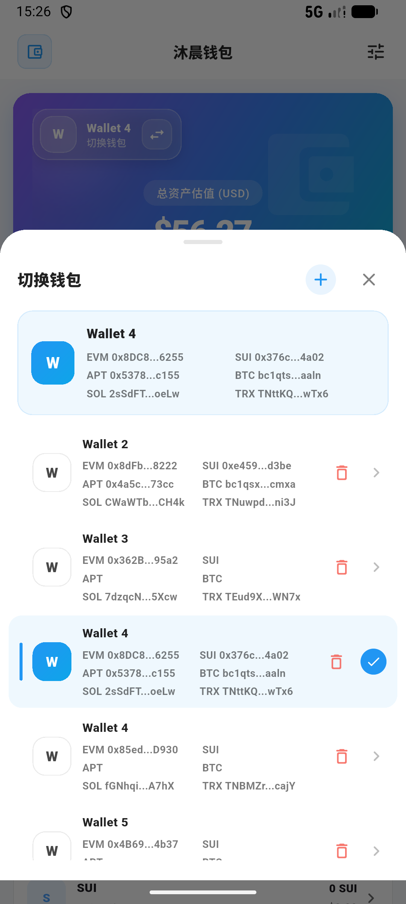 | 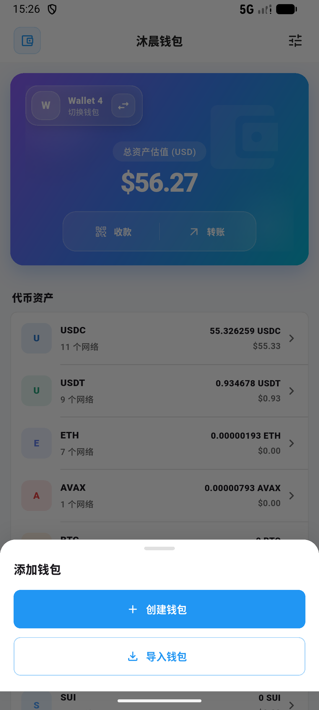 | 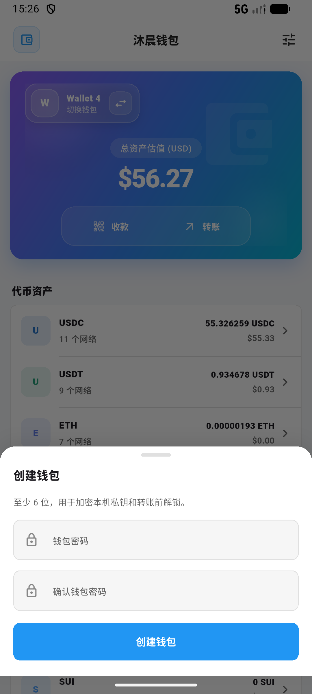 |

| Mnemonic Confirmation | Wallet Details | Addresses And Keys | Rename Wallet |
|-----------------------|----------------|--------------------|---------------|
| 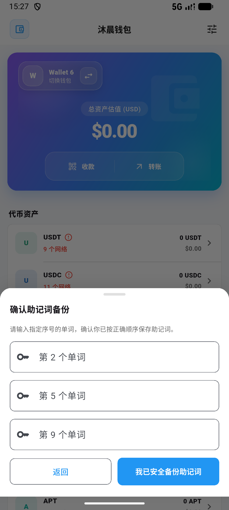 | 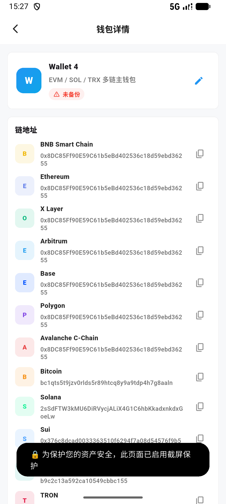 | 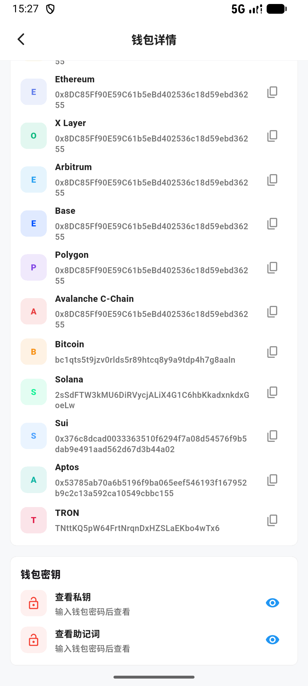 | 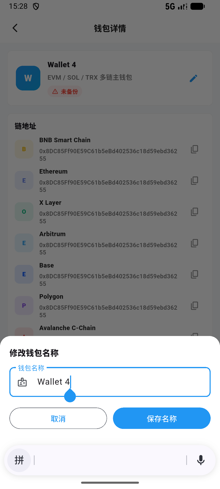 |

| Cross-chain Token | Transaction History | Transaction Details | Receive QR Code |
|-------------------|---------------------|---------------------|-----------------|
| 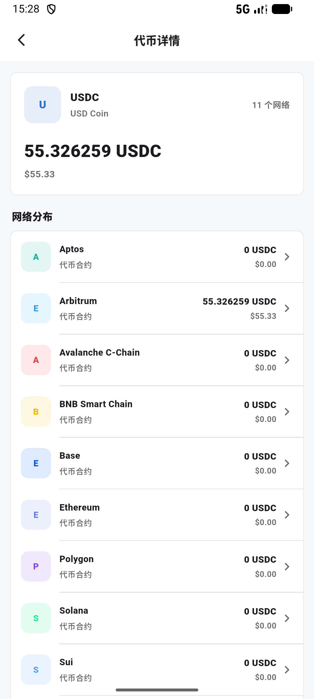 | 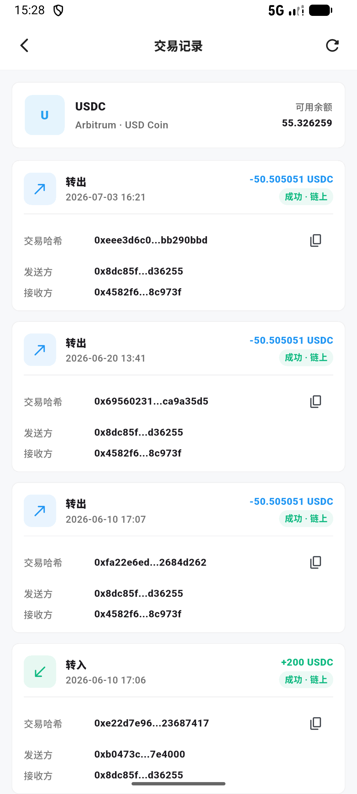 | 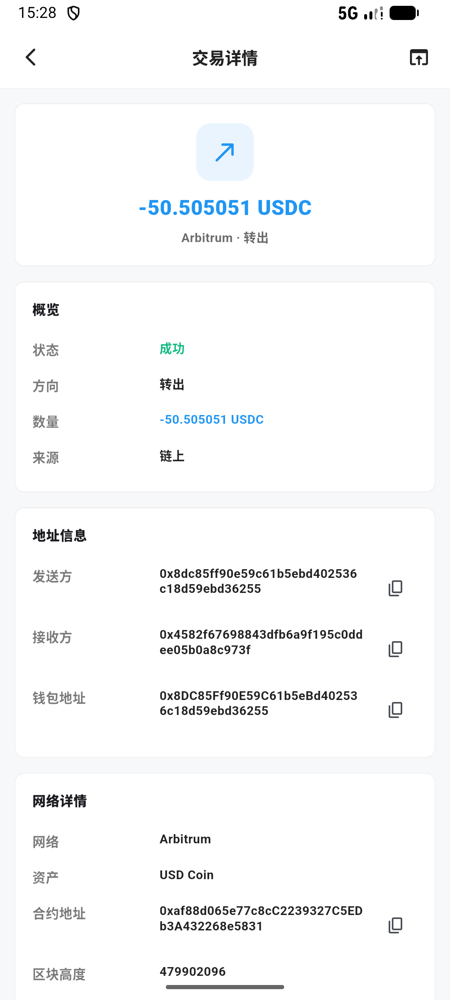 | 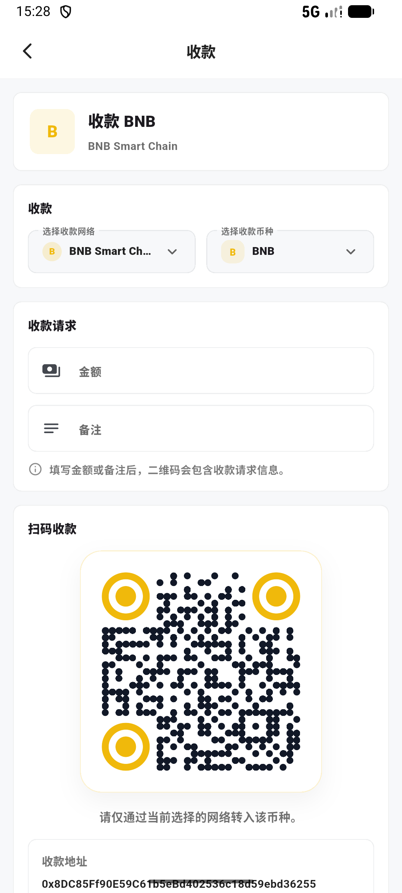 |

| Settings | Security Settings | Address Book | Add Contact |
|----------|-------------------|--------------|-------------|
| 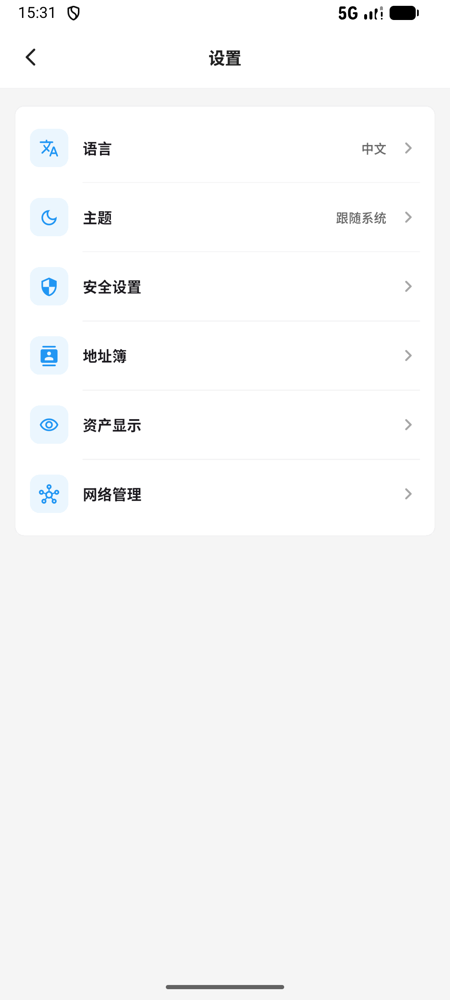 | 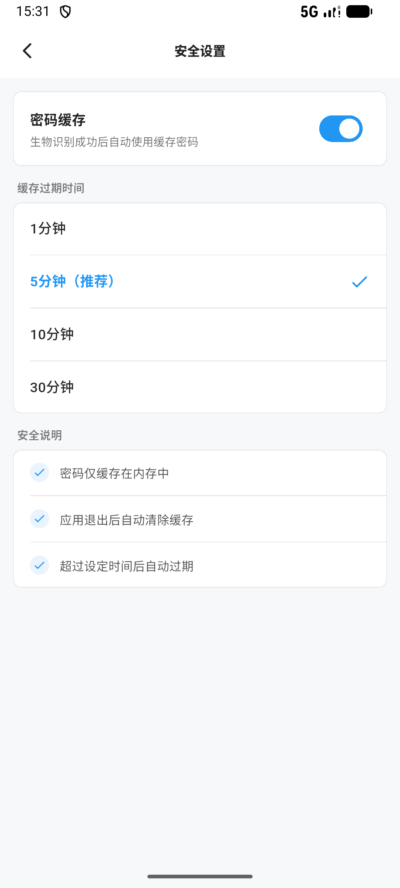 | 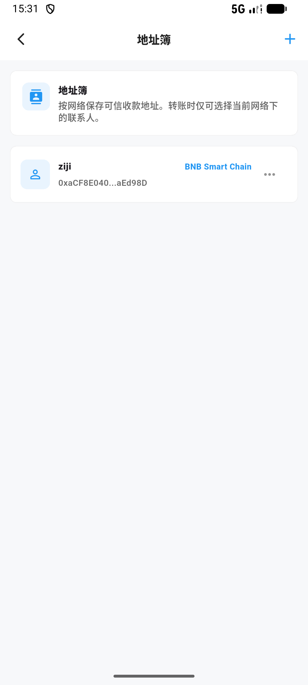 | 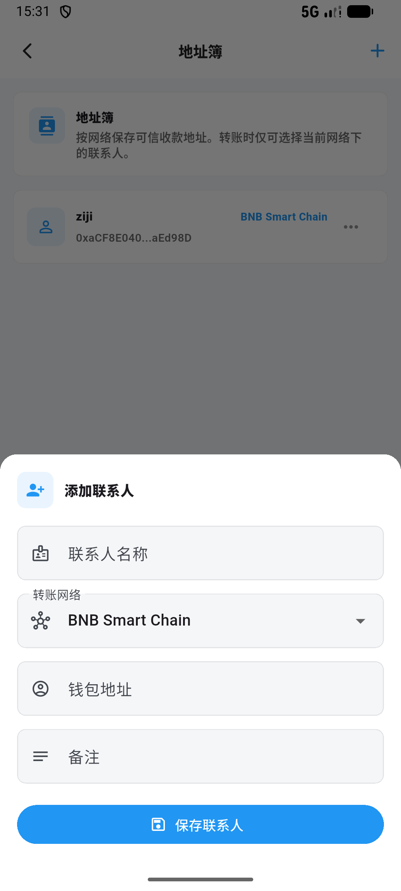 |

| Asset Visibility | Add Custom Token | Network Management | Add Custom Network |
|------------------|------------------|--------------------|--------------------|
| 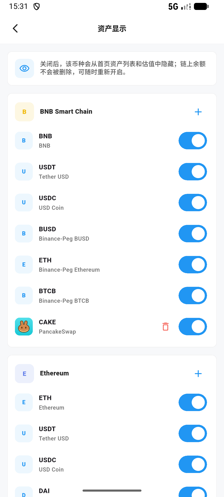 | 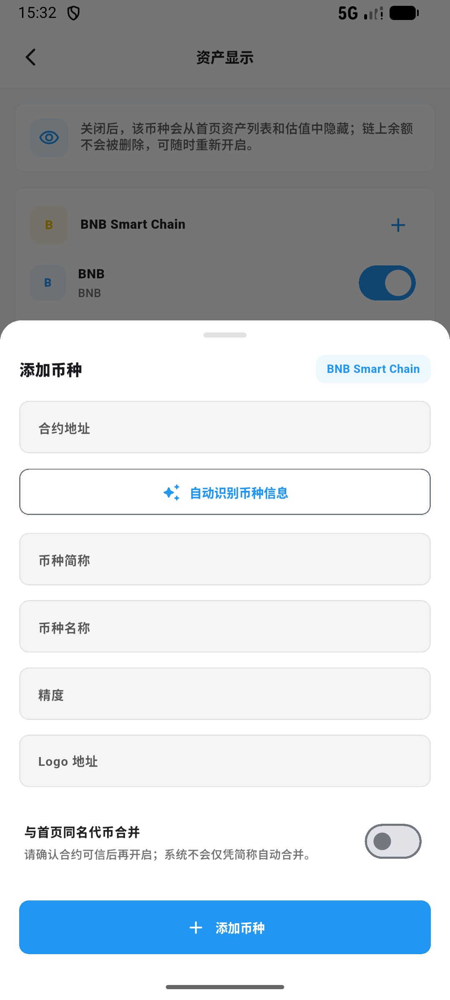 | 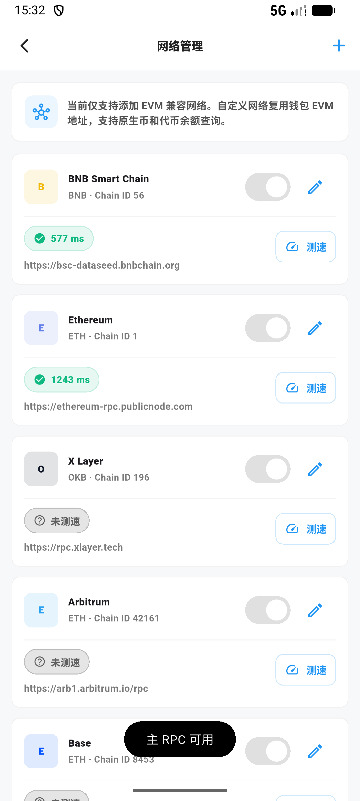 | 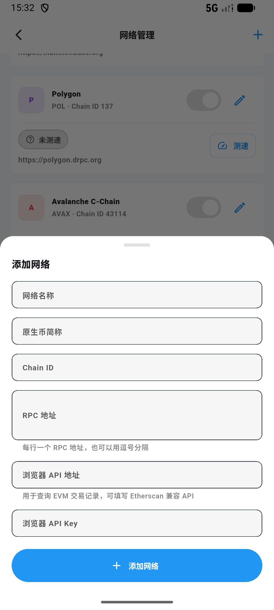 |

## License

This project is for learning and research purposes only.
